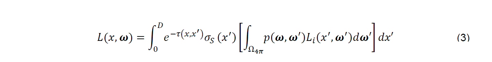

## 通过创新塑造未来-从医学成像到精准医疗

摘要:医学影像是疾病诊断、治疗和随访的重要信息来源。此外，由于其病人的特殊性，成像信息是推动精准医疗进入临床实践的关键组成部分。该手稿描述了最近开发的更好地处理图像信息的技术:具有电影渲染的医学图像的真实感可视化，用于深入图像理解的人工代理，对微创程序的支持，以及具有增强预测能力的特定于患者的计算模型。在整个手稿中，我们将分析这些技术的能力，并推断其潜在的影响，以提高医疗质量，同时降低其成本。

#### 介绍

近几十年来，医学影像对医学实践产生了影响，极大地提高了疾病的诊断、治疗和随访水平。在影像引导下，微创手术在医院里变得越来越普遍，取代了传统的手术，使得术后并发症更少，恢复更快。我们预计这一趋势将继续下去，医学成像在将精准医疗推向临床实践方面发挥着越来越重要的作用。通过能够描述病人的解剖、生理和代谢特征，医学成像能够实现精确的、个性化的程序和预测的、病人特有的治疗选择和分娩。

在这篇文章中，我们重点介绍了一些我们最有可能在未来几年为医学成像的成功做出贡献的技术，帮助医疗保健的发展，同时降低其成本。在第1节中，我们将讨论电影渲染，这是一种3D可视化技术，能够从传统的计算机断层扫描(CT)或磁共振(MR)体积生成超逼真的图像，从而潜在地增强病理的显著性。第2节讨论的主题是下一代图像理解，这有助于更快和更可复制的图像阅读，受益于机器学习和人工智能的最新进展。此外，在第3节中，我们将讨论手术室的实时成像需求，并重点讨论心脏瓣膜程序，讨论它们的规划和指导。最后，在第4节中，我们提出了患者特异性的计算模型，有助于在诊断、患者分层、治疗选择和治疗优化方面取得进展。论文中显示的所有图像都是真实的、活生生的病人的图像。

#### 1. 电影渲染:医学图像的真实感可视化

有效的临床决策和程序要求快速评估医学图像中包含的相关信息。尽管基于多平面重建(MPR)的医学图像查看在诊断成像中仍占主导地位，但医学数据三维可视化的重要性正在上升。这是因为这些方法能够更快地理解空间解剖结构，并有可能提高医学图像的敏感性和特异性。特别是那些没有接受过平面图像观察训练的医学专业人员以及患者都能从这种可视化中获益。

计算机图形学的最新进展使基于物理的交互式体可视化技术成为可能。这种技术通过模拟真实世界中光与物质的相互作用，在计算机生成的图像中再现复杂的照明效果。这些结果是物理上可信的图像，通常更容易被人类大脑解读，因为大脑经过训练，能够解读最细微的阴影线索，从而重建形状和深度信息。基于更简单的几何计算(如光线投射)，计算机生成的图像往往缺少这种阴影提示。

我们开发了一种基于物理的体绘制方法，称为电影渲染[Engel 2016;Paladini 2015]实时计算可见光子与扫描病人解剖结构的相互作用。该算法采用蒙特卡罗路径跟踪方法，利用随机过程，通过对每个像素上数百或数千个光子路径的光传输模拟，生成逼真甚至超逼真的图像(图1)。

​    图1:电影渲染。左:原始CT数据;右:相同数据集的电影渲染。数据由德国汉堡的以色列建筑师Krankenhaus提供。

在传统的体射线铸造中，只考虑辐射能量沿直线的发射和吸收。辐射能𝑞$_e$发射每一点𝑥′沿射线最大距离D。

发出的辐射能吸收每一点根据比尔-朗伯定律沿射线到观察者的位置与吸收系数𝜎$_𝑎$.

在传统的体绘制中，通常使用考虑体数据局部梯度信息(局部光照)的表面阴影模型来模拟单个散射。虽然这个积分可以用黎曼积分很容易地数值求解，但该方法忽略了具有多个散射事件和光消光(全局照明)的复杂光路。

而蒙特卡罗路径跟踪积分法求解的多维非连续绘制方程为:

方程(3)决定了辐射通量(光辉)L距离收到𝝎方向沿着x射线。我们必须把光辉分散到那个方向从所有可能的方向𝝎′点沿着雷到一个最大距离d相关组织的光学特性定义使用相位函数𝑝(𝝎,𝝎′),它描述了一部分光线沿着一个方向𝝎′𝝎被散射到方向。𝐿$_i$(𝑥′,𝝎′)的辐射距离𝑥从方向𝝎′′。在实际应用中，我们使用henye - greenstein相位函数对不同组织类型的散射进行建模，并使用BRDF(双向反射分布函数)计算隐式表面的阴影。辐射散射到方向𝝎也是𝝎吸收和散射的方向。这是模仿使用光学深度𝜏,消光系数𝜎$_𝑡$=𝜎$_𝑠$+𝜎$_𝑎$,定义为散射的总和(𝜎$_𝑠$)和吸收(𝜎$_𝑎$)系数:

注意，相对于外散射、吸收和内散射，为了简单起见，渲染方程中省略了发射。由于渲染方程无法用解析方法计算，用数值方法求解这个积分需要在多个距离上采样，每个距离上采样的方向都不同。此外,𝐿$_𝑖$必须呈现相同的计算方程允许多个散射事件。由于这在计算上过于复杂，蒙特卡罗方法允许我们计算光线在随机方向散射的随机位置上的辐射。通过平均许多这样的蒙特卡罗样本成一个单一的图像，我们可以逐步产生一个平滑的最终结果。通过多次采样，大大加快了算法的收敛速度。

利用高动态范围的光照环境，利用基于图像的光照对医学数据进行照明，既可以进行摄影捕捉，也可以进行综合生成。与使用传统光线投射方法生成的图像相比，摄影捕捉的光线使数据呈现出非常自然的外观。这种自然光与光子散射和吸收的精确模拟相结合，产生了逼真的图像(见图1)，类似于可以在自然界中观察到的许多阴影效果，如软阴影、环境遮挡、体积散射和地下光子相互作用。通过模拟一个可变孔径、焦距和曝光的虚拟相机，可以产生额外的效果，如景深和运动模糊。动态模糊允许使用我们的关键帧动画引擎生成的电影在快速相机运动期间更流畅，而类似于摄影，景深效果允许将观众的注意力集中在特定的结构上。

除了真实感，该算法还允许可视化不可见或隐藏的过程，如在心脏表面的电激活传播或体内的代谢过程。这种超逼真的图像是通过模拟受电激活影响的体素的可见光光子发射、正电子发射断层扫描(PET)显示的代谢增加或双能CT扫描中检测到的化合物(如尿酸钠)来创建的(图2)。

​                                        图2:痛风可视化。利用双能CT扫描模拟urate探测过程中的光子发射。

将PET、MR、CT等不同的成像方式结合在一张图片中，并结合模拟和计算数据，为显示解剖结构与功能数据的空间关系提供了重要的灵活性(见图3)。

图3:人脑可视化。左图:用7T扫描仪拍摄的大脑磁共振(MR)图像的电影效果图。数据由德国莱比锡马克斯普朗克研究所提供。右图:三个解剖MR切片的电影渲染，功能磁共振成像(fMRI)，以及由大脑扩散张量成像(DTI)计算的纤维数据。功能磁共振成像(fMRI)捕捉到的语音中心的激活是利用光发射建模的，结果在解剖学上产生了黄色发光的灯光效果。

电影渲染的另一个重要应用是将4D CT或MR扫描的动态过程可视化，并结合来自模拟的时间相关数据。所有这些数据源都可以逐帧组合，并使用动画引擎播放，从而创建逼真的电影，从而向目标观众传达有效的临床信息。

虽然诊断仍将依赖于传统的基于平面重建的可视化方法，但我们有强烈的迹象表明，特殊的诊断应用可能会受益于新的电影渲染技术的灵活性和表现力。例如，手术计划和术中成像对这种可视化方法有着强烈的需求，需要对人体解剖和过程有良好的空间理解(图4)。

图4:多创伤可视化。多发脊柱和肋骨骨折的多创伤患者的电影效果图。CT图像数据由加拿大温哥华总医院提供。

此外，超现实成像技术在医学学生和普通大众解剖教育中的应用是显而易见的。最后，这类图像对于医疗专业人员之间或患者之间的发现、诊断和手术结果的有效沟通是理想的，可能会增加对临床决策和程序的信任。